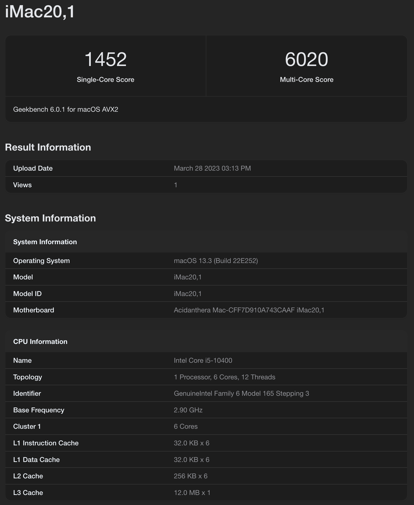

# Language: [[English]](README.md)[Vietnames]
# Hackintosh-Intel-i5-10400-Asrock-B460M-PRO(OpenCore 0.9.0 - macOS Ventura 13.2.1, updated 13.3)

# Thông tin máy

- Mainbroad: Asrock B460M Pro **[Link mua](https://www.anphatpc.com.vn/mainboard-asrock-b460m-pro4.html)**
- CPU: Intel® Core™ i5-10400 **[Link mua](https://www.anphatpc.com.vn/cpu-intel-core-i5-10400-12m-cache-2.90-ghz-up-to-4.30-ghz-6c12t-socket-1200-comet-lake-s_id32925.html)**
- Ram: 16GB (2x6GB) **[Link](https://www.anphatpc.com.vn/ram-kingston-hyperx-fury-8gb-1x8gb-ddr4-bus-2666mhz-black.html)**
- SSD: Samsung 970 EVO plus 512 **[Link mua](https://memoryzone.com.vn/ssd-samsung-970-evo-plus-pcie-nvme-v-nand-m-2-2280-500gb-mz-v7s500bw)**
- Wifi card: Broadcom BCM94352Z **[Link mua](https://shopee.vn/Card-WiFi-DW1560-(BCM94352Z)-cho-laptop-c%C3%B3-ch%C3%A2n-m2-ngff-i.74031021.7255189037)**

    
    

# Nguồn Hackintosh + OpenCore
- **[Trang chủ opencore](https://dortania.github.io/OpenCore-Desktop-Guide)**.
- **[Wifi - Chú ý phiên bản MacOS trong hướng dẫn](https://elitemacx86.com/threads/how-to-enable-intel-wifi-on-macos-clover-opencore.604/)**.
- **[Bluletooth - Chú ý phiên bản MacOS trong hướng dẫn](https://elitemacx86.com/threads/how-to-enable-broadcom-bluetooth-on-macos.607/)**.
- **[Thời gian boot lâu - Cần thay SSD khác có hỗ trợ TRIM native cho MacOS](https://github.com/dortania/bugtracker/issues/192)**.

# Hoạt động tốt
- Continuity:
    - Handoff
    - iMessage
    - Air Drop
- DisplayPort Output (4k resolution / 75hz)
- Sleep
- Wake
- Audio (Chọn cổng suất tiếng)
- Ethernet
- Bluetooth
- WiFi
- All USB ports (Đã map USB theo mainbroad và hub)
- Dual Boot (Windows + MacOS) (Chú ý: Cài phân vùng MacOS lên vị trí đầu)
- Khởi động khoảng 40s (tính từ lúc vào chọn boot entry)

# Có thể chưa hoạt động được
- HDMI Port - Có thể chưa hoạt động do mình k sử dụng HDMI nên chưa vá lỗi

# CHÚ Ý
Sửa MLB, SystemSerialNumber, SystemUUID trong file config để sử dụng EFI - mỗi máy cần có một Seri riêng

```
		<dict>
			<key>AdviseFeatures</key>
			<false/>
			<key>MLB</key>
			<string>XXXXXXXXXXXXXXXXX</string>
			<key>MaxBIOSVersion</key>
			<false/>
			<key>ProcessorType</key>
			<integer>0</integer>
			<key>ROM</key>
			<data>ESIzRFVm</data>
			<key>SpoofVendor</key>
			<true/>
			<key>SystemMemoryStatus</key>
			<string>Auto</string>
			<key>SystemProductName</key>
			<string>iMac20,1</string>
			<key>SystemSerialNumber</key>
			<string>XXXXXXXXXXXX</string>
			<key>SystemUUID</key>
			<string>XXXXXXXX-XXXX-XXXX-XXXX-XXXXXXXXXXXX</string>
		</dict>
```


# Hỗ trợ:
- **[Facebook](https://www.facebook.com/haitrvnvn/)**
